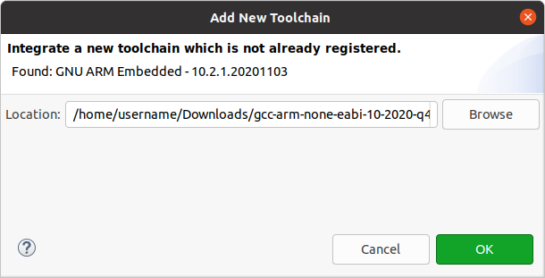

 
<a>
   

      
      
   

</a>
 

# FSP Board pack installation on Renesas e2 studio

## Renesas e2 studio installer

- Download the e2 studio Linux AppImage from the  [Renesas Github repository](https://github.com/renesas/fsp/releases). For example, e2 studio installer for FSP version 3.5.0 can be downloaded here: [setup_fsp_v3_5_0_e2s_v2021-10.AppImage](https://github.com/renesas/fsp/releases/download/v3.5.0/setup_fsp_v3_5_0_e2s_v2021-10.AppImage)
- Perform a Quick Install, this will automatically include the latest FSP and GNU Arm Embedded Toolchain versions.

## Manual FSP Update

- Download the latest FSP packs as zip file from the  [Renesas Github repository](https://github.com/renesas/fsp/releases). For example, version 3.5.0 can be downloaded here: [FSP_Packs_v3.5.0.zip](https://github.com/renesas/fsp/releases/download/v3.5.0/FSP_Packs_v3.5.0.zip)

### Install Renesas FSP packs

1. Open Renesas e2 studio and go to `Help -> CMSIS Packs Management -> Renesas RA`.
2. Here you will see the internal packs folder.

1. Extract the downloaded packs on the FSP folder path: `unzip FSP_Packs_v2.4.0.zip -d /home/username/.eclipse/com.renesas.platform_1177272026/`.

2. Now check on e2 studio that the packs were detected and installed successfully:

Note: Check the permissions on this folder, Renesas e2 studio will need to write on this directory.

### Install GNU Arm Embedded Toolchain

1. Download and extract the latest version from [ARM Developer site](https://developer.arm.com/tools-and-software/open-source-software/developer-tools/gnu-toolchain/gnu-rm/downloads). micro-ROS demos are tested with this version: [gcc-arm-none-eabi-10.3-2021.10-x86_64-linux.tar.bz2 ](https://developer.arm.com/-/media/Files/downloads/gnu-rm/10.3-2021.10/gcc-arm-none-eabi-10.3-2021.10-x86_64-linux.tar.bz2).

2. Open e2 studio and go to `Help -> Add Renesas Toolchains -> Add...`.
3. Click on Browse and select the compiler extracted folder, the compiler should be detected automatically:

