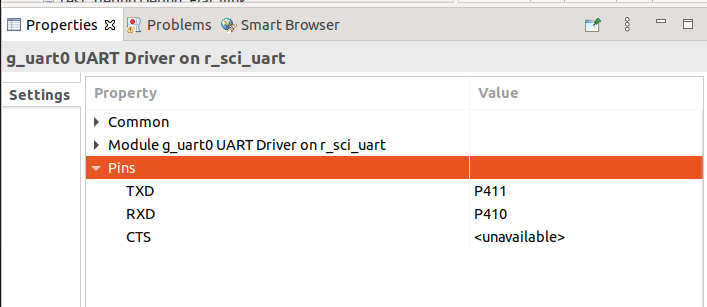
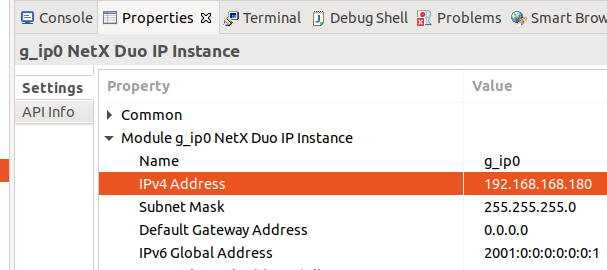

 
<a>
   

      
      
   

</a>
 

# micro-ROS transports for  Renesas e2 studio

Depending on which transport is used for micro-ROS specific configurations should be done.

- [micro-ROS transports for  Renesas e2 studio](#micro-ros-transports-for--renesas-esup2sup-studio)
  - [USB-CDC transport](#usb-cdc-transport)
  - [Serial UART transport](#serial-uart-transport)
  - [UDP transport (FreeRTOS + TCP)](#udp-transport-freertos--tcp)
  - [UDP transport (ThreadX + NetX)](#udp-transport-threadx--netx)

## USB-CDC transport
1. Copy the following files file to the source directory:
      - `extra_sources/microros_transports/usb_transport.c`
      - `extra_sources/microros_transports/usb_descriptor.c`
2. Double click on the `configuration.xml` file of your project and go to the `Stacks` tab.
3. Select `New Stack -> Middleware -> USB -> USB PCDC driver on r_usb_pcdc`.
4. Go to `Clocks` tab and configure `UCLK` clock to match 48MHz (Match the values on the highlighted boxes):

   

5. Save the modification using `ctrl + s` and click on `Generate Project Content`.

## Serial UART transport
1. Copy the following files file to the source directory:
      - `extra_sources/microros_transports/uart_transport.c`
2. Double click on the `configuration.xml` file of your project and go to the `Stacks` tab.
3. Select `New Stack -> Driver -> Connectivity -> r_src_uart`.
4. *Optional: in order to set P411 and P410 as Tx/Rx first disable SPI1*
5. Go to the component properties and configure the Tx/Rx pinout:

   

6. Save the modification using `ctrl + s` and click on `Generate Project Content`.

## UDP transport (FreeRTOS + TCP)

1. Copy the following files file to the source directory:
      - `extra_sources/microros_transports/udp_transport_freeRTOS.c`

2. Double click on the `configuration.xml` file of your project and go to the `Stacks` tab.
3. Select `New Stack -> FreeRTOS -> Libraries -> FreeRTOS + TCP`.
4. Configure the properties of the `FreeRTOS + TCP component`:
   1. `Common -> Use DHCP` to `Enable`.
   2. `Common -> DHCP Register Hostname` to `Disable`.
   3. `Common -> vApplicationIPNetworkEventHook` to `Disable`.

   

5.  Save the modification using `ctrl + s` and click on `Generate Project Content`.

TODO: increase net buffer size?

## UDP transport (ThreadX + NetX)

1. Copy the following files file to the source directory:
      - `extra_sources/microros_transports/udp_transport_threadX.c`
2. Double click on the `configuration.xml` file of your project and go to the `Stacks` tab.
3. Select `New Stack -> Azure RTOS -> NetX Duo -> NetX Duo IP instance`.
4. Configure the properties of the `NetX Duo IP instance`:
   1. Configure the board network parameters:

   

   2. *Optional: Select the Ethernet Driver submodule `g_ether0` and set the board MAC address on `Module g_ether0 Ethernet Driver on r_ether -> General -> MAC address`*.

5.  Save the modification using `ctrl + s` and click on `Generate Project Content`.

TODO: Add detail on agent IP and port (Configure the micro-ROS Agent IP and port on the `udp_transport.c` file:)
