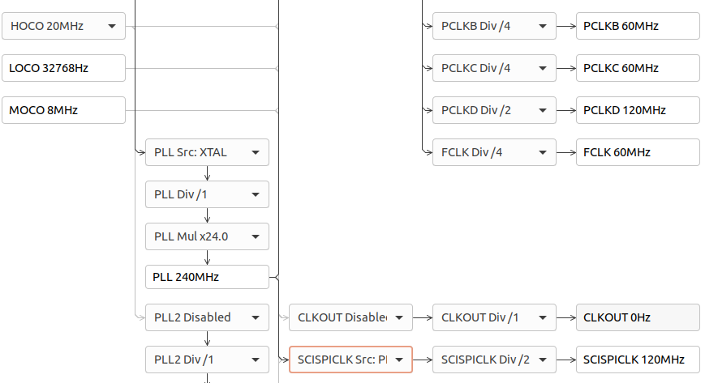
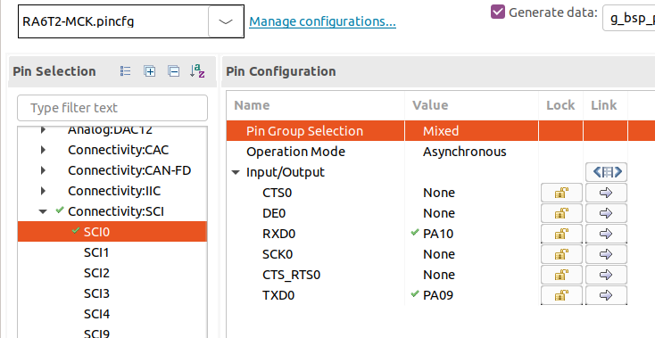
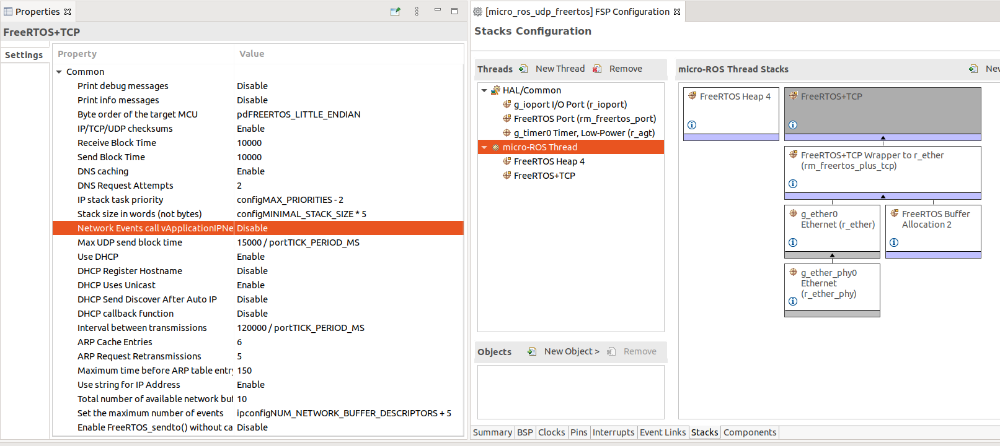
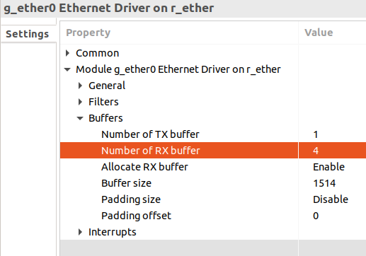
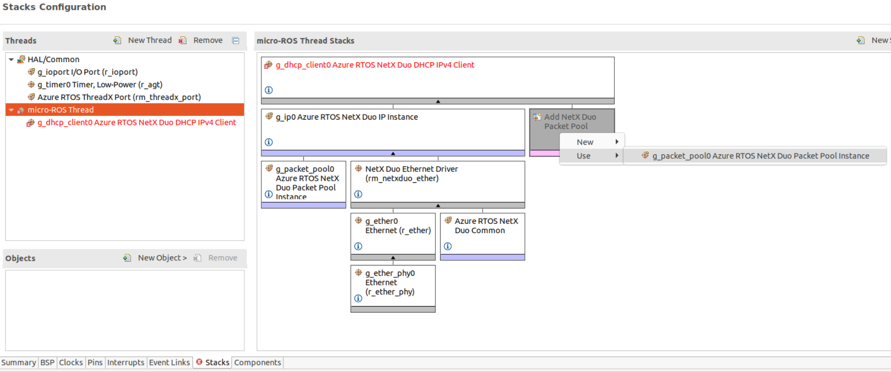
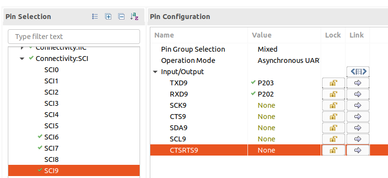
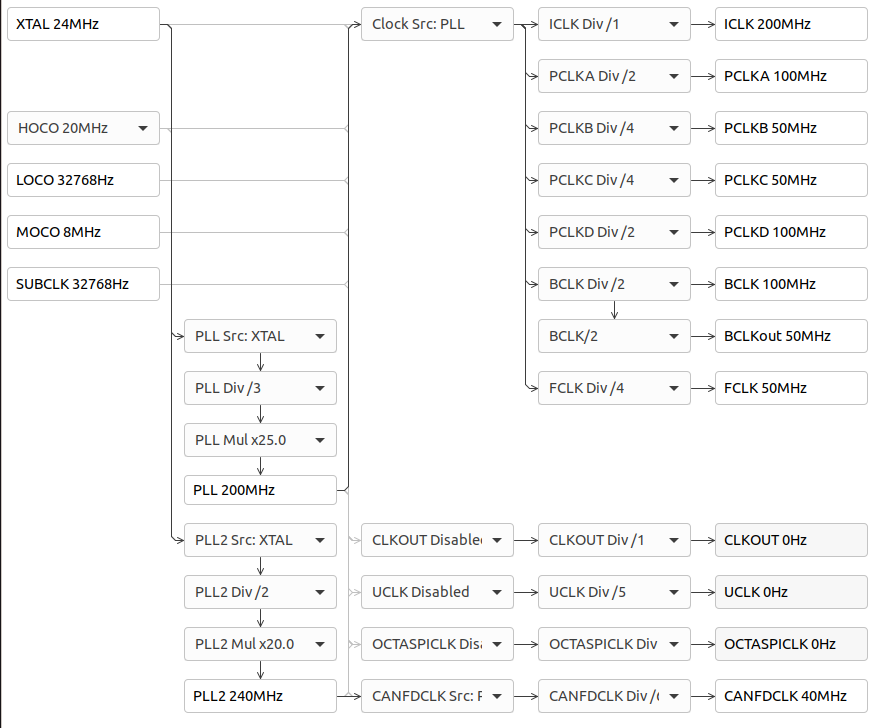
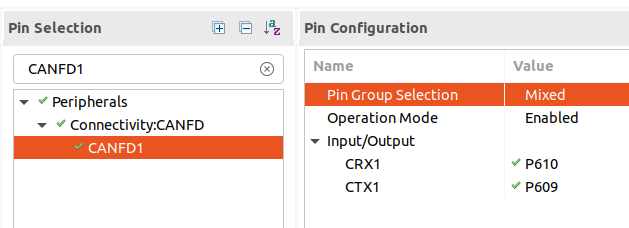

<br/>
<a>
   <p align="center">
      
      
   </p>
</a>
<br/>

# micro-ROS transports for  Renesas e<sup>2</sup> studio

Depending on which transport is used for micro-ROS specific configurations, the following should be done.

- [micro-ROS transports for  Renesas e<sup>2</sup> studio](#micro-ros-transports-for--renesas-esup2sup-studio)
  - [USB-CDC transport](#usb-cdc-transport)
  - [Serial UART transport](#serial-uart-transport)
  - [UDP transport (FreeRTOS + TCP)](#udp-transport-freertos--tcp)
  - [UDP transport (ThreadX + NetX)](#udp-transport-threadx--netx)
  - [TCP WIFI transport (AWS Secure Sockets - FreeRTOS)](#tcp-wifi-transport-aws-secure-sockets---freertos)
  - [CAN FD transport](#can-fd-transport)

## USB-CDC transport
1. Copy the following files to the source directory:
      - `extra_sources/microros_transports/usb_transport.c`
      - `extra_sources/microros_transports/usb_descriptor.c`
2. Double click on the `configuration.xml` file of your project and go to the `Stacks` tab.
3. Select `New Stack -> Middleware -> USB -> USB PCDC driver on r_usb_pcdc`.
4. Go to `Clocks` tab and configure `UCLK` clock to match 48MHz (Match the values on the highlighted boxes):

   

5. Save the modifications by clicking on `Generate Project Content`.

## Serial UART transport

The configuration of this transports is board dependant:

<details>
<summary>EK-RA6M5</summary>

1. Copy the following files to the source directory:
      - `extra_sources/microros_transports/uart_transport.c`
2. Double click on the `configuration.xml` file of your project and go to the `Stacks` tab.
3. Select `New Stack -> Driver -> Connectivity -> r_src_uart`.
4. *Optional: in order to set P411 and P410 as Tx/Rx first disable SPI1*
5. Go to the component properties and configure the Tx/Rx pinout:

   

6. Save the modifications clicking on `Generate Project Content`.

</details>

<details>
<summary>MCK-RA6T2</summary>

   1. Copy the following files to the source directory:
      - `extra_sources/microros_transports/uart_transport.c`
   2. Double click on the `configuration.xml` file of your project and go to the `Stacks` tab.
   3. Select `New Stack -> Driver -> Connectivity -> r_src_b_uart`.
   4. Go to `Clocks` tab and enable `SCISPICLK` clock.

      *Example clock configuration:*

      

   5. Go to the Pins tab and configure the SCI port 0 and its pinout:

      

      *Optional: in order to set PA09 and PA10 as Tx/Rx first disable the timers GPT8 and GPT9*

   6. Save the modifications clicking on `Generate Project Content`.
</details>

## UDP transport (FreeRTOS + TCP)

1. Copy the following files to the source directory:
      - `extra_sources/microros_transports/udp_transport_freeRTOS.c`

2. Double click on the `configuration.xml` file of your project and go to the `Stacks` tab.
3. Select `New Stack -> Networking -> FreeRTOS + TCP`.
4. Configure the properties of the `FreeRTOS + TCP component`:
   1. `Common -> vApplicationIPNetworkEventHook` to `Disable`.
   2. `Common -> DHCP Register Hostname` to `Disable`.
   3. *Optional: Enable DHCP `Common -> Use DHCP` to `Enable`*.
   
      *Note: If DHCP is disabled, the board network parameters can be configured on the transport source file `udp_transport_freeRTOS.c`*

   4. *Optional: Increase number of buffers avaliable to the IP stack on `Common -> Total number of avaliable network buffers`*.

   

5. Increase number of Ethernet Tx buffers on `g_ether0 component -> Module g_ether0 Ethernet Driver on r_ether -> Buffers -> Number of RX buffer` to 4:

   

6.  Save the modifications by clicking on `Generate Project Content`.
7.  Configure micro-ROS agent IP and port passing a freeRTOS `freertos_sockaddr` struct to the `rmw_uros_set_custom_transport` function:

      ```c
      struct freertos_sockaddr remote_addr;
      remote_addr.sin_family = FREERTOS_AF_INET;
      remote_addr.sin_port = FreeRTOS_htons(8888);
      remote_addr.sin_addr = FreeRTOS_inet_addr("192.168.1.185");

      rmw_uros_set_custom_transport(
         false,
         (void *) &remote_addr,
         renesas_e2_transport_open,
         renesas_e2_transport_close,
         renesas_e2_transport_write,
         renesas_e2_transport_read);
      ```

## UDP transport (ThreadX + NetX)

1. Copy the following files to the source directory:
      - `extra_sources/microros_transports/udp_transport_threadX.c`
2. Double click on the `configuration.xml` file of your project and go to the `Stacks` tab.
3. Select `New Stack -> Networking -> Azure RTOS NetX Duo DHCP IPv4 Client`.
4. Click on Add NetX Duo Network Driver and select `New -> NetX Duo Ethernet Driver (rm_netxduo_ether)`:
5. Click on Add NetX Duo Packet Pool and select `Use -> g_packet_pool0 Azure RTOS NetX Duo Packet Pool Instance`:

   

6. *Optional: Increase number of buffers avaliable to the IP stack on `g_packet_pool0` properties on `Module g_packet_pool0 Azure RTOS NetX Duo Packet Pool Instance -> Number of Packets in Pool`*.
7.  Save the modifications by clicking on `Generate Project Content`.
8.  Configure micro-ROS agent IP and port passing a `custom_transport_args` struct to the `rmw_uros_set_custom_transport` function:

      ```c
      custom_transport_args remote_addr = {
         .agent_ip_address=IP_ADDRESS(192,168,1,185),
         .agent_port=8888
      };

      rmw_uros_set_custom_transport(
         false,
         (void *) &remote_addr,
         renesas_e2_transport_open,
         renesas_e2_transport_close,
         renesas_e2_transport_write,
         renesas_e2_transport_read);
      ```

## TCP WIFI transport (AWS Secure Sockets - FreeRTOS)

This transport supports Renesas [Wi-Fi-Pmod-Expansion-Board](https://www.renesas.com/eu/en/products/microcontrollers-microprocessors/ra-cortex-m-mcus/wi-fi-pmod-expansion-board-80211bgn-24g-wi-fi-pmod-expansion-board) based on Silex SX-ULPGN module.  
Support for other wifi modules can be added to the FSP as explained on chapter `4. Adding Support for New Wi-Fi module` of this document: 
[Getting Started with the Wi-Fi Modules on FSP](https://www.renesas.com/eu/en/document/apn/getting-started-wi-fi-modules-fsp)

 *Note: This configuration is valid for the connector PMOD1 (J26)*

1. Copy the following files to the source directory:
      - `extra_sources/microros_transports/wifi_transport_freeRTOS.c`

2. Double click on the `configuration.xml` file of your project and go to the `Stacks` tab.
3. Select `New Stack -> Networking -> AWS Secure Sockets on WiFi`.
4. Remove the `AWS Secure Sockets TLS Support` submodule of the created module: `Right click -> Delete`.
5. Enable `Common -> General -> Use Mutexes` on the micro-ROS thread properties.
6. Configure the module reset pinout on the `rm_wifi_onchip_silex` module properties:
   1. Set `Common -> Module Reset Port` to 3.
   2. Set `Common -> Module Reset Pin` to 11.
7. Configure the properties of the PMOD connection under the UART component properties (`g_uart0 UART (r_sci_uart)`)
   1. Enter Enable `FIFO support`, `DTC support` and `Flow control support` on `common` properties
   2. Add `DTC drivers` for Transmission and Reception:

      

   3. Select the SCI port 9 on `Module g_uart0 UART (r_sci_uart) -> General -> Channel`.
   4. Go to the Pins tab and configure the SCI port and its pinout:

      

      *Optional: in order to set P203 and P202 as Tx/Rx first disable SPI0*

   5. *Optional: To increase data throughput, increase the baud rate on `Module g_uart0 UART (r_sci_uart) -> Baud -> Baud Rate`.  
      Values up to `460800 bauds` has been tested*

8.  Save the modifications by clicking on `Generate Project Content`.
9.  Configure the transport connection passing a `custom_transport_args` struct to the `rmw_uros_set_custom_transport` function:
    1.  Configure the wifi network with a `WIFINetworkParams_t` object:
         ```c
         // Configure wifi network
         WIFINetworkParams_t network_conf = {
            .ucChannel                  = 0,
            .ucSSID  = "[YOUR_SSID_HERE]",
            .xPassword.xWPA.cPassphrase = "[YOUR_PSK_HERE]",
            .xSecurity = eWiFiSecurityWPA2,
         };
         ```

         *Notes:*  
            - *Currently only the following security protocols are supported: `eWiFiSecurityOpen`, `eWiFiSecurityWPA` and `eWiFiSecurityWPA2`*  
            - *The network ssid and password length is limited to 31 characters*

    2. Configure agent IP and port on a `SocketsSockaddr_t` object:
         ```c
         // Configure agent address
         SocketsSockaddr_t socket_addr = {
               .ulAddress = SOCKETS_inet_addr_quick(192, 168, 1, 93),
               .usPort    = SOCKETS_htons(8888)
         };
         ```

    3. Add the configuration the a `custom_transport_args` struct and pass it down to the `rmw_uros_set_custom_transport` method:

         ```c
         // Add configuration to transport args
         custom_transport_args wifi_args = {
            .network_conf = &network_conf,
            .socket_addr = &socket_addr
         };

         rmw_uros_set_custom_transport(
               false,
               (void *) &wifi_args,
               renesas_e2_transport_open,
               renesas_e2_transport_close,
               renesas_e2_transport_write,
               renesas_e2_transport_read
            );
         ```

## CAN FD transport
1. Copy the following files to the source directory:
      - `extra_sources/microros_transports/canfd_transport.c`
2. Double click on the `configuration.xml` file of your project and go to the `Stacks` tab.
3. Select `New Stack -> Driver -> Connectivity -> r_canfd`.
4. Go to `Clocks` tab:
   1. Configure `CANFDCLK` clock to match 40 MHz.
   2. Make sure `PCLKB` clock is set to 50 MHz and `PCLKA` to 100 MHz.

      *Example clock configuration:*

      

5. Configure CAN reception:
   1. `Common -> Reception -> Message Buffers -> Number of Buffers` to `0`.
   2. `Common -> Reception -> FIFOs -> FIFO 0 -> Enable` to `Enabled`
   3. `Common -> Reception -> FIFOs -> FIFO 0 -> Interrupt Mode` to `Every Frame`.
   4. `Common -> Reception -> FIFOs -> FIFO 0 -> Payload Size` to `64 bytes`.

6. Configure CAN interrupts:
   1. Enable `Module g_canfd0 CANFD Driver on r_canfd -> Transmit Interrupts -> TXMB 0`.
   2. Set `Module g_canfd0 CANFD Driver on r_canfd -> Interrupts -> Channel Interrupt Priority Level` to `Priority 3`.
   3. Enable all interrupts on `Module g_canfd0 CANFD Driver on r_canfd -> Channel Error Interrupts`.

7. Configure CAN component:
   1. `Module g_canfd0 CANFD Driver on r_canfd -> General -> Channel` to `1` for `RA6M5` boards and to `0` for `RA6T2`.
   2. Go to the Pins tab and configure your `CANFD1` pinout. As an example to use with the integrated `TJA1042T` transceiver:

      

      *Note: `TJA1042T` transceiver is only integrated on `EK-RA6M5` boards*

8. Configure your CAN FD Bitrate:
   1. As an example:

      

   2. Make sure the configuration matches with the CAN used on the agent. Example configuration on linux:
      ```bash
      sudo ip link set can0 up type can bitrate 500000 sample-point 0.75 dbitrate 2000000 fd on
      sudo ifconfig can0 txqueuelen 65536
      ```

9.  Modify micro-ROS library build options:
    1.  Create a file named `app_colcon.meta` on your project main directory.
    2.  Add the following configuration to the file:
        ```
        {
            "names": {
                "rmw_microxrcedds": {
                    "cmake-args": [
                        "-DRMW_UXRCE_STREAM_HISTORY=8"
                    ]
                },
                "microxrcedds_client": {
                    "cmake-args": [
                        "-DUCLIENT_CUSTOM_TRANSPORT_MTU=63"
                    ]
                },
            }
        }
        ```

    3.  *Optional: Increase the number of stream buffers to match your message requirements with `RMW_UXRCE_STREAM_HISTORY`.*

        This parameter will control the maximum payload of a publish message:
        `RMW_UXRCE_STREAM_HISTORY * UCLIENT_CUSTOM_TRANSPORT_MTU (bytes)`

    4. To rebuild the micro-ROS library, clean and rebuild your project.

10. Set CAN transport configuration on the `canfd_transport.c` file:
    1. Set an unique CAN frame ID for this device (CAN_ID).
    2. *Optional: Increase reception buffer size (CAN_BUFFER_SIZE).*
    3. *Optional: Enable the BRS (bit rate switch) flag (enable_BRS).*

         *Example CAN transport configuration:*

         

11. Save the modifications clicking on `Generate Project Content`.